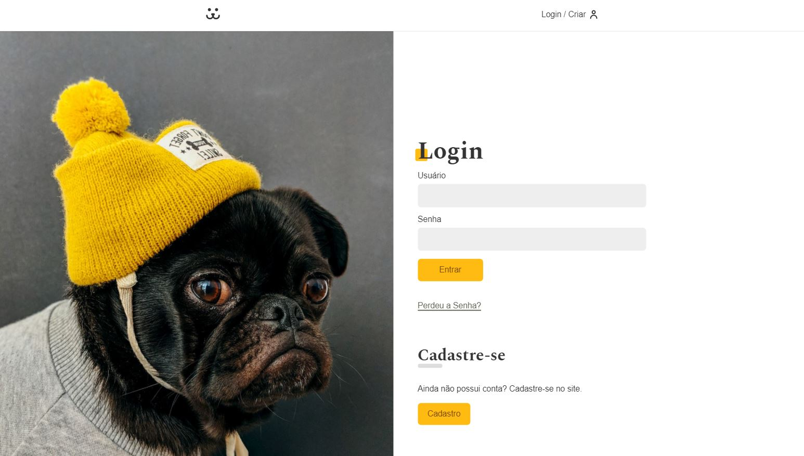

<h1 align="center">
    
</h1>

<p align="center">
  <a href="#-project">Project</a>&nbsp;&nbsp;&nbsp;|&nbsp;&nbsp;&nbsp;
  <a href="#-technologies">Technologies</a>&nbsp;&nbsp;&nbsp;|&nbsp;&nbsp;&nbsp;
  <a href="#-how-to-run">How to run</a>
</p>

<p align="center">
  
</p>

## 💻 Project

Dogs is a social network where users can post photos, delete photos, comment and see statistics about their best friend.

> You can check the application [demo](https://dogs-reactjs.netlify.app/) here using the user below!

> User: dog | Password: dog

## 🔧 Technologies

- [React](https://reactjs.org/)

## 😊 How to run

Before starting, you need to have [Git](https://git-scm.com) and [Node](https://nodejs.org/en/) installed on your machine.

```sh
- Clone this repo:
$ git clone https://github.com/marcelopajr/dogs.git

- Enter directory:
$ cd dogs

- Install dependencies:
$ npm install

- Launch the app:
$ npm start
```

Have fun!
